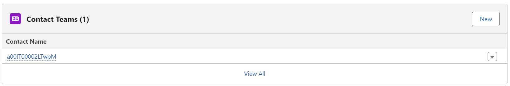

# ContactTeams

## Project Overview

To provide a custom solution for the Account Teams process inside Salesforce for Contact Object which is a standard object in Salesforce this can be also be applied to custom objects.

### Features

- **Feature 1:** Create a UI for handling the team records.

- **Feature 2:** Override the New button with Aura wrapped LWC Component. 

- **Feature 3:** Share the contact records with the selected user effortlessly using the apex sharing.

## Prerequisites

List any prerequisites needed to deploy the project. This typically includes:

- **Salesforce CLI:** Instructions for installation can be found [here](https://developer.salesforce.com/tools/sfdxcli).
- **A Salesforce Developer Edition Org or a Trailhead Playground:** Needed to create Scratch Orgs and for deployment.

## Installation Instructions

### Step 1: Clone the Repository

Clone the project repository. 

```
git clone https://github.com/RazaHussain090/ContactTeams.git
cd ContactTeams
```
### Step 2: Log in to Salesforce
Log in to Salesforce using the CLI.

```
sfdx auth:web:login -d -a <OrgsName>
```
-d sets the logged-in org as the default Dev Hub.  
-a gives an alias to the Dev Hub org for easier reference.  

### Step 3: Create a Scratch Org (Optional)
Create a Scratch Org if you want to deploy the code on to the scratch org but you must have a devhub connected.

```
sfdx force:org:create -s -f config/project-scratch-def.json -a <scratch-org-alias>
```
-s sets this Scratch Org as the default for this project.  
-f specifies the path to the Scratch Org definition file.  
-a assigns an alias to the Scratch Org.

### Step 4: Push the Project to the Scratch Org
Guide on pushing the project to the newly created Scratch Org.

```
sfdx force:source:push
```
### Step 5: Open the Scratch Org
Provide instructions to open the Scratch Org in a web browser.
```
sfdx force:org:open
```
### Usage

### Contributing

### License
